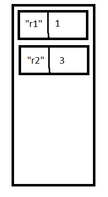
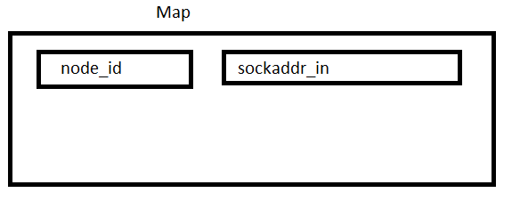
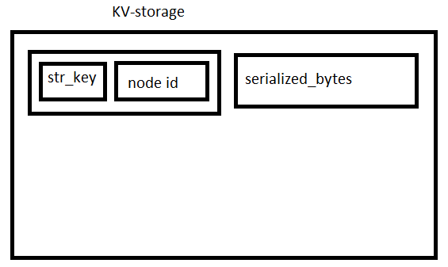

# Introduction
  This project represents a distrubuted key-value store - the storage of information between various network nodes. This architechture
allows storing large amount of information that may exceed RAM or permanents storage capacity of a single node. These KV pairs can be erased as needed and overwritten by using version numbers.

# Architecture
  From the description of the project we are able to identify major components that will play a critical role in our desing.
The components are the following:
* Map
* Array
* Dataframe (with corresponding classes)
* Serialization
* Networking interface
* Sorer (.sor file reader)
* Utilities (Thread, etc.)

The most critical component in the storage is **Map** that will store information using **Key** (String and nodeId) associated with
serialized binary information represented by *char* (or *unsigned char*) type. The map will able to store information locally as well
as remotely on other nodes. If information is not found locally, the current node makes a request to the node containing the information.
Internally, map will have some sort of mechanism or interface allowing it to request information from the nodes on the network. To determine
whether information is available locally or not, we have two options:
- **Map**
Another map could be used for storing Keys - String for keys and nodeId for values. While this method seems to be the most efficient, 
it assumes the uniqueness of keys and does not allow data to be separated between several nodes: part of the data will be stored
locally and the other part remotely
- **Array** of Key objects (preferred)
The array will store the array of Keys. The key will then be retrieved using get(int index) method in the array. After retrieving
the key, we can get a list of nodes associated with the key, and begin assembling the solution from several nodes.

**Application** is the user-level interface that will be used for submitting storing and retrieving data. The application will have the following
functionalities:
* Reading from the file (of .sor format)
* Storing information to the key-value store
* Retrieving information from the key-value store

Reading from the file will be performed using Sorer class - the file parser developed by us in Assignment 1. The class is a simple file reader
that is capable of reading the file in .sor format. Each value is surrounded by angle brackets (*<*  and *>*). There are four classes of values:
double, int, bool, String.
As information is being read, it is sent to populate the DataFrame - another storage class designed by us in Assignment 4. DataFrame is the 2D 
array represented by rows and columns with row names. While the role of DataFrame in this schema is not clear at the moment, it is required
to be used by our instructor.
Considering that we pick Array as the storage of Key objects, creating a DataFrame fromArray() or fromScalar() requires a Key and a pointer to the key-value
storage. At this point in time, we store the key into the Array as send the serialized value to the key-value store. The store then may store it locally
or distribute it to other nodes. The method by which it determines could be the following:
* Allocate a finite amount of memory on current node (5GB for example), and once the storage hits the threshold, begin sending data remotely
* Replace amount of memory with number of rows/columns stored per node (depending on the role of the DataFrame)
* Combine previous approach with allowing chankifying the data - the data could be stored locally and remotely at the same time

# Implementation
Our implementation is not focused on speed, but rather being able to pass in 10GB of data reasonably quickly.
The program begins by running file named **demo**. The program begins with creating an instance of Application, and then calling its **run** method. First, the method creates a fixed number of network nodes that will store the data. Then, it opens the .sor file containing the data. The file reader reads a fixed amount of rows at a time into the buffer and then serializes it. The data is then stored locally or remotely. The Array of Keys has the information about the (String) keys associated with node ids. 

Each node also has a Map of node ids as keys and sockaddr_in as values.

The actual storage is also represented as Map, where Key objects are used as keys and serialized data is used as values.

For Array and Map, we are using the Array and Map classes from our previous assignments. Array is implemented as the dynamic array, and Map is represented as an extendable HashMap.
Application also has **stop()** method that terminates all network nodes, and terminates the program.

The actual storage of serialized data is represented by KVStore class, which has the following methods:
* **put(k, v)**
  _Takes in two values - key and value - and stores them locally or remotely._
* **get(k)**
  _Queries the KV store and reassembles the DataFrame from the given key (non-blocking)_
* **waitAndGet(k)**
  _Queries the KV store and reassembles the DataFrame from the given key (blocking)_

Application
- run()
- readData()
- stop()

# Use cases

# Open questions
* Connection between DataFrame and key-value store (represented by Map)

# Status
At the moment, it is required by us to take care of our technical debt. The following components (with estimated fix time) are to be fixed:
* Sorer (8-10 hours)
* DataFrame (5-10 hours)
* Serialization (5-10 hours)
* Networking interface (10+ hours)
Sorer and Networking are expected to take the majority of our time to be fixed. The total estimated time to fix solve all the issues are 40-50 hours.
